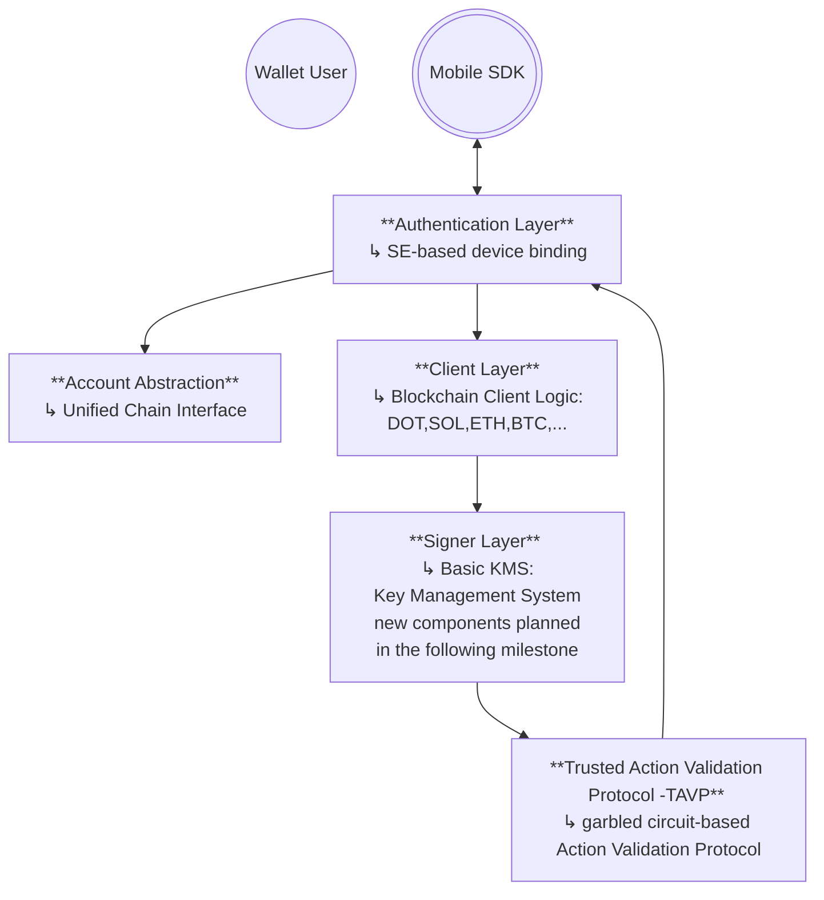

# Modular Architecture Overview

This document presents the modular architecture supporting Interstellar’s secure transaction infrastructure. It outlines the main components, their interactions, and how they enable cross-chain transaction validation and execution.

---

##  Layered Architecture

Interstellar’s infrastructure is built on composable, secure layers that abstract over cryptographic operations, account models, and validation mechanisms.

Each layer has a defined interface, allowing for secure upgrades and back-end substitution (e.g., switching signing schemes or enclave types) without disrupting the overall system logic.

### Architecture Diagram

:::info 🔭 Architecture (including components planned in Milestone 3)

The full modular architecture, including future components such as the **Transaction Management Layer** and **Signer Orchestrator**, is described in the canonical architecture documentation:

👉 [Canonical Architecture Overview](/developers/components/architecture.md)

These components are defined structurally but will be fully implemented and delivered in Milestone 3 and beyond.

:::

---

## 🧩 Component Overview

### 1. **Client Layer**

- Executes chain-specific client logic and validation flows within the trusted worker runtime.  
- Encapsulates coin-specific transaction input and feedback via unified UX components.  
- Some elements already run inside enclave logic; full modularization is planned in M3.

### 2. **Key Management Service (KMS) in Signer Layer**### 1. **Client Layer**

- Provides in-enclave keypair generation and signing for supported chains.  
- Keys reside only in enclave runtime memory (no SGX sealing in M2).  
- Import/export restrictions and persistent sealing will be introduced in M3.  
- Acts as a security boundary isolating private key material from application logic.

### 3. **Authentication Layer**

- Establishes trusted user-device identity through:
  - Secure Element (SE)-based signature proofs.
  - Device entropy and environmental context.
- Used during account onboarding, recovery, and validation.

### 4. **Trusted Action Validation Protocol - TAVP**

- Uses garbled circuits to generate ephemeral cognitive validation challenges.
- Prevents replay, remote hijacking, or automated signing in sensitive flows.
- Combines visual cryptography, hardware profile checks, and behavioral inputs.
- Can be triggered conditionally (e.g., above transaction thresholds).

### 5. **Account Abstraction Layer**

- Abstracts over different blockchain paradigms:
  - **Bitcoin**: UTXO set management, address encoding, fee policies.
  - **Ethereum/Polkadot/Solana**: nonce handling, gas limits, account model.
- Provides a unified API to the transaction layer, reducing complexity for clients.

---

## Integration Flow

1. **User** initiates a transaction request via a secure client interface.
2. The request flows through the Account Abstraction layer.
3. A pre-signing hook **triggers TAVP** in KMS.
4. Upon succesfull validation the signer layer processes the request.
5. KMS returns the raw signature, which is then broadcast using chain-specific logic.

---

## ⚠️ Security & Feature Status

| Component                    | Current Status     | Upcoming Improvements       |
|-----------------------------|--------------------|-----------------------------|
| SGX/TEE protection of KMS   | Partial            | Key sealing in M3     |
| Modular Signer integration  | Not yet included   | Planned                     |
| Threshold-based validation  | Not yet included   | Planned                     |
| TAVP (garbled circuit validation)       | Available          | Ongoing optimizations       |
| SE-based device auth        | Available          | Extended attestation planned |
| UTXO + Account abstraction  | Available          | Maintained                  |

---

## Summary

This architecture enables secure, modular, and policy-aware transaction flows across multiple blockchain networks. Each layer is independently upgradable and designed to support future cryptographic schemes, enclave types, and decentralized signing protocols.

It ensures a clear separation between transaction intent, user validation, and signature execution — laying the foundation for a scalable and secure cross-chain wallet infrastructure.

:::info 📘 Component Documentation References

For in-depth details on each architectural layer, refer to the canonical documentation:

- Account Abstraction Layer
- [Transaction Management Layer](/developers/components/transaction-management-layer/index.mdx)
- [Signer Layer (KMS) and Signer Orchestrator](/developers/components/signer-layer/index.mdx)
- Authentication Layer
- Trusted Action Validation Protocol (TAVP)
- Client Layer

These components are versioned independently and may include specifications that extend beyond the current milestone scope.
:::