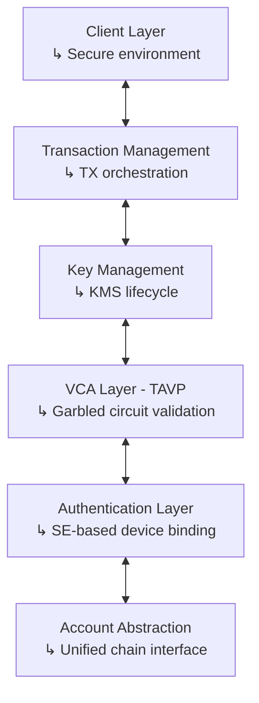

# Modular Architecture Overview

This document presents the modular architecture supporting Interstellar’s secure transaction infrastructure. It outlines the main components, their interactions, and how they enable cross-chain transaction validation and execution.

---

## 🧱 Layered Architecture

Interstellar’s infrastructure is built on composable, secure layers that abstract over cryptographic operations, account models, and validation mechanisms.

Each layer has a defined interface, allowing for secure upgrades and back-end substitution (e.g., switching signing schemes or enclave types) without disrupting the overall system logic.

### Basic Architecture Diagram

---

## 🧩 Component Overview

### 1. **Client Layer**

- Provides an interface for user actions (e.g., transaction requests).
- Runs in a secure runtime environment (e.g., enclave workers).
- Handles interaction with chain-specific logic and validation flows.
- Encapsulates coin-specific TX input and feedback via unified UX components.

### 2. **Transaction Management Layer**

- Manages transaction creation, fee calculation, broadcasting, and confirmation.
- Supports both **UTXO-based** and **account-based** blockchain models.
- Interfaces with the KMS for signing requests.
- Delegates pre-signing validation (e.g., amount threshold, TAVP invocation).

### 3. **Key Management Service (KMS)**

- Manages private key generation, import, export restrictions, and signing.
- Intended to run within a secure execution environment (e.g., SGX, TDX).
- Produces raw signatures or delegates to a signer layer depending on the backend.
- Acts as a security boundary isolating key material from the app logic.

### 4. **Authentication Layer**

- Establishes trusted user-device identity through:
  - Secure Element (SE)-based signature proofs.
  - Device entropy and environmental context.
- Used during account onboarding, recovery, and validation.

### 5. **VCA Layer (Trusted Action Validation Protocol)**

- Uses garbled circuits to generate ephemeral cognitive validation challenges.
- Prevents replay, remote hijacking, or automated signing in sensitive flows.
- Combines visual cryptography, hardware profile checks, and behavioral inputs.
- Can be triggered conditionally (e.g., above transaction thresholds).

### 6. **Account Abstraction Layer**

- Abstracts over different blockchain paradigms:
  - **Bitcoin**: UTXO set management, address encoding, fee policies.
  - **Ethereum/Polkadot/Solana**: nonce handling, gas limits, account model.
- Provides a unified API to the transaction layer, reducing complexity for clients.

---

## 🧪 Integration Flow

1. **User** initiates a transaction request via a secure client interface.
2. **Transaction Management Layer** validates format, fee, and network parameters.
3. A pre-signing hook may **trigger the VCA layer** based on policy (e.g., high amount).
4. If allowed, the request is routed to the **KMS**.
5. **KMS** (and optionally a Signer Layer) returns the raw or policy-bound signature.
6. The transaction is broadcast to the target chain using chain-specific logic.

---

## ⚠️ Security & Feature Status

| Component                    | Current Status     | Upcoming Improvements       |
|-----------------------------|--------------------|-----------------------------|
| SGX/TEE protection of KMS   | Partial             | Full isolation planned      |
| Modular Signer integration  | Not yet included    | Planned                     |
| Threshold-based validation  | Not yet included    | Planned                     |
| VCA for TX validation       | Available           | Ongoing optimizations       |
| SE-based device auth        | Available           | Extended attestation planned |
| UTXO + Account abstraction  | Available           | Maintained                  |

---

## 📌 Summary

This architecture enables secure, modular, and policy-aware transaction flows across multiple blockchain networks. Each layer is independently upgradable and designed to support future cryptographic schemes, enclave types, and decentralized signing protocols.

It ensures a clear separation between transaction intent, user validation, and signature execution — laying the foundation for a scalable and secure cross-chain wallet infrastructure.

