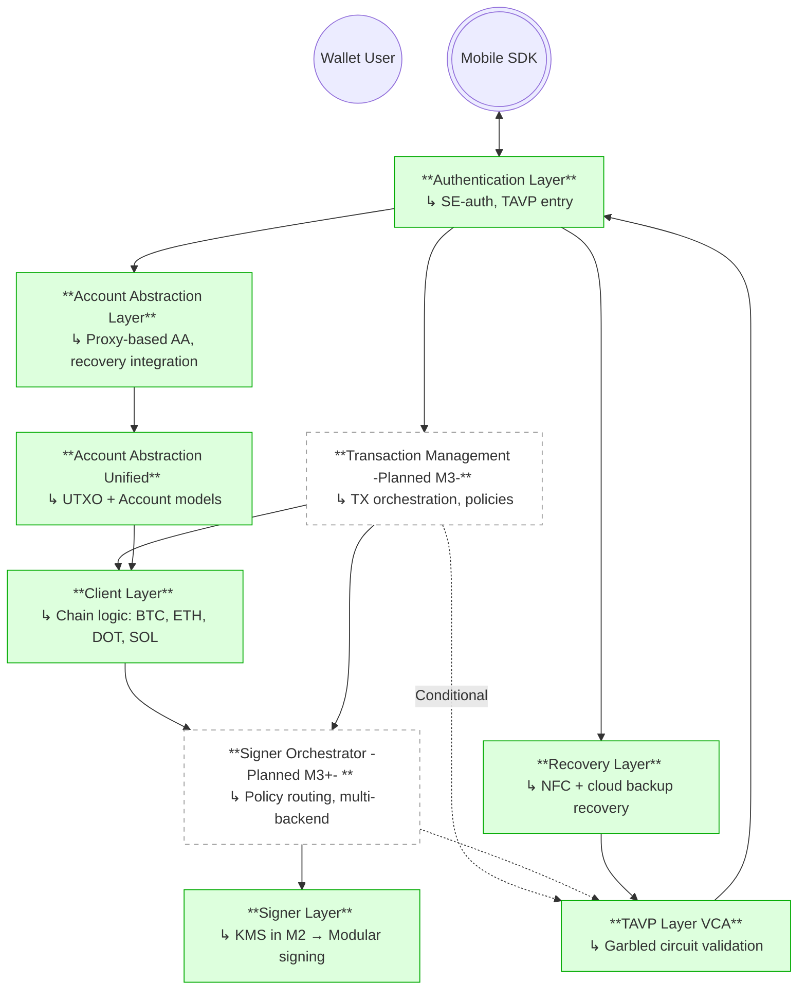

# Canonical Architecture Overview

This document defines the canonical architecture of the Interstellar infrastructure. It provides a full-stack, milestone-agnostic reference that connects each modular component to its dedicated documentation, and clarifies delivery status across M1, M2, and planned future milestones.

---

## Layered Architecture

Interstellar’s system is built from independently evolving and composable layers. Each layer exposes a stable interface that supports chain abstraction, modular cryptographic backends, and secure transaction validation.

The canonical diagram reflects all major layers — delivered or planned.  
Dashed nodes represent planned or evolving components.  
Solid nodes represent already delivered components (M1 or M2).

---

## Layer Index

Each layer has a dedicated canonical documentation entry under `/developers/components`.

### 1. [Client Layer](/developers/category/layered-architecture)

- Runs inside enclave workers (e.g., Integritee)  
- Supports BTC, ETH, DOT, SOL testnets  
- Provides coin-specific transaction broadcasting, nonce tracking, and UTXO management  

### 2. [Transaction Management Layer](/developers/components/transaction-management-layer)

- Planned for M3  
- Will orchestrate policy enforcement, conditional validation, and abstract transaction lifecycle  
- Will interface with the Signer Orchestrator and VCA  

Planned features:  
- Beneficiary whitelists  
- Threshold-based policy logic  
- Multi-policy routing  

### 3. [Signer Layer](/developers/components/signer-layer)

- Provides the cryptographic interface for transaction signing  
- In M2, only a **basic KMS** is implemented inside Integritee workers  
- Future support for multiple TEEs (TDX, SEV, Arm CCA) and optional MPC/NMC/TSS backends (**all post-mainnet**)  

Subcomponents:  
- [Basic KMS](/developers/components/signer-layer)  
- [Signer Orchestrator (Planned)](/developers/components/signer-layer)  

### 4. [Authentication Layer](/developers/category/layered-architecture)

- Enforces SE-based identity binding  
- Validates user-device integrity during onboarding and sensitive actions  
- Delivered in M1  

### 5. [TAVP Layer (VCA)](/developers/category/layered-architecture)

- Delivered in M1 and extended in M2  
- Garbled circuit-based validation to enforce real-time behavioral challenges  
- Supports cognitive resistance against automated attacks and malware  
- Triggered in all sensitive operations  

### 6. [Account Abstraction Layer](/developers/category/layered-architecture)

- Abstracts over UTXO (Bitcoin) and account-based models (Ethereum, Polkadot, Solana)  
- Provides unified structure for transaction generation and fee estimation  
- Delivered in M1 and extended in M2  

### 7. [Recovery Layer](/developers/category/layered-architecture)

- Delivered in M1  
- Combines SE-based key wrapping with:  
  - Cloud backup integration  
  - NFC-enabled recovery flows  
- Interacts with Account Abstraction and TAVP during account reconstitution  

---

## Component Status Summary

| Layer / Component            | Delivery Milestone | Status       |
|------------------------------|---------------------|--------------|
| Account Abstraction Layer    | M1 / M2             | Delivered    |
| Authentication Layer         | M1                  | Delivered    |
| Recovery Layer               | M1                  | Delivered    |
| TAVP Layer (VCA)             | M1 / M2             | Delivered    |
| Client Layer                 | M2                  | Delivered    |
| Signer Layer (Basic KMS)     | M2                  | Delivered    |
| Transaction Management Layer | Planned (M3)        | Planned      |
| Signer Orchestrator          | Planned (M3+)       | Planned      |

---

## Integration Flow Summary

> See [each component's documentation](/developers/category/layered-architecture) for deeper integration-level details.

1. User triggers a transaction via the mobile SDK.  
2. Authentication Layer validates device signature and identity binding.  
3. Transaction request is passed to the Client Layer for construction.  
4. TAVP is invoked to validate cognitive and behavioral challenge.  
5. Request is passed to the Signer Layer (KMS).  
6. Signature is returned and transaction broadcast to the network.  

When Transaction Management and the Signer Orchestrator are introduced:  
- Policies, routing logic, and backend orchestration will be centralized there.  
- Future evolution may extend to multiple TEE technologies (TDX, SEV, Arm CCA) to reduce reliance on a single vendor.  
- Threshold / MPC / NMC signing backends are **strategic post-mainnet goals**, not part of M3 delivery.  

---

## Summary

This architecture serves as the stable foundation of Interstellar’s modular infrastructure. It decouples validation, transaction orchestration, cryptographic security, and recovery — allowing independent evolution across milestones, and laying the groundwork for future TEE diversity and distributed signing.  

All future milestone docs reference this canonical model to avoid redundancy and ensure architectural consistency.
